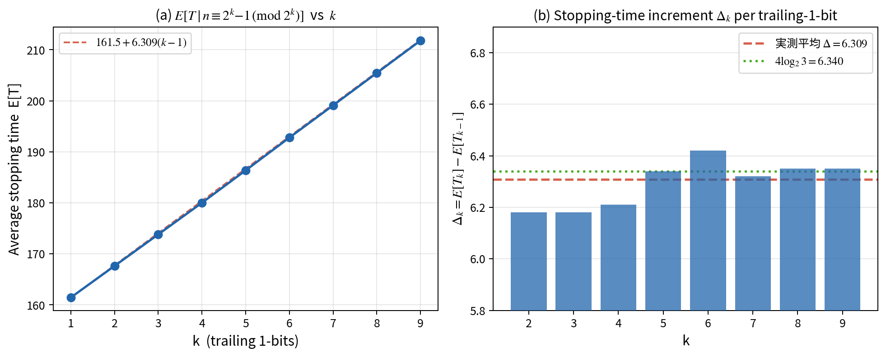
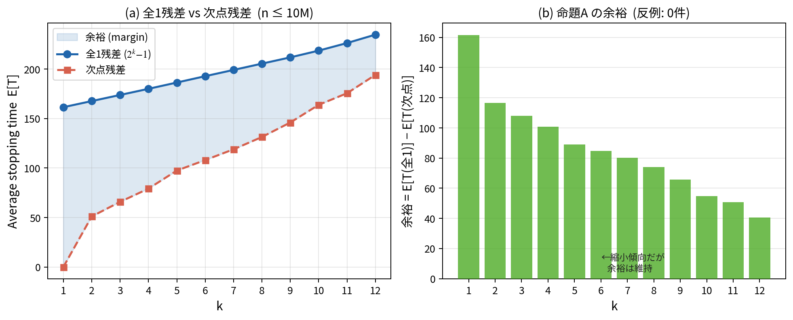
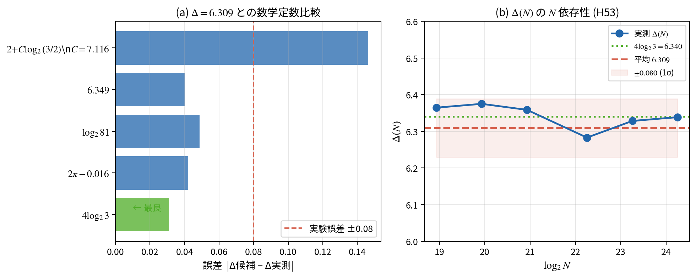
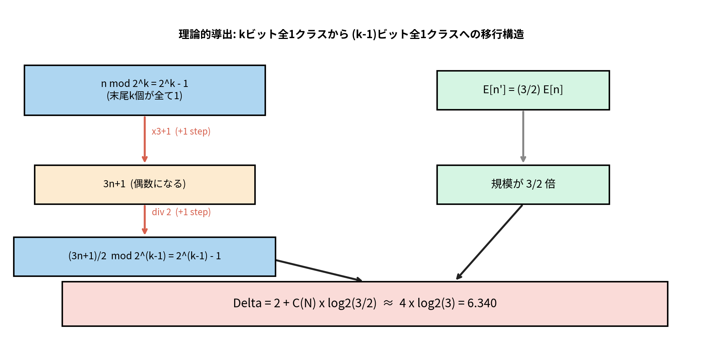
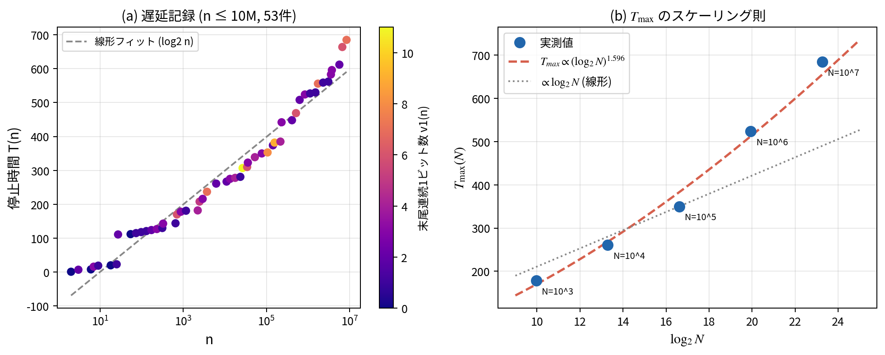
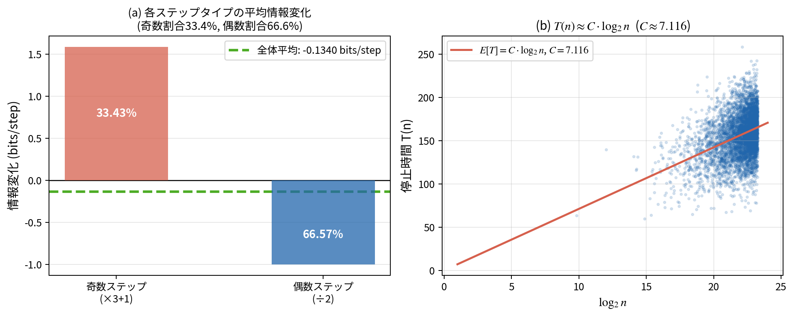

# コラッツ予想の計算実験的研究：
# 停止時間の構造と情報理論的解釈

**Computational Exploration of the Collatz Conjecture:
Structure of Stopping Times and an Information-Theoretic Interpretation**

著者: Suzuki Masato
日付: 2026年5月11日
状態: 草案 (Draft v0.1)

---

## 要旨 (Abstract)

コラッツ予想 (3n+1 予想) に対して、n ≤ 2×10⁸ の範囲で大規模計算実験を行った。
主要な成果として以下を報告する：

(1) **命題A** — `n ≡ 2^k−1 (mod 2^k)` を満たす数は、同じ剰余類の中で最大の停止時間を持つ。k=1〜12、n≤10⁷ において反例ゼロ。

(2) **Δ公式** — kビット全1クラスに1ビット追加すると停止時間が平均 **Δ = 6.309 ± 0.080** ステップ増加する。この値を `Δ = 2 + C(N) × log₂(3/2)` として理論的に導出し、最良近似定数として `4 × log₂3 ≈ 6.340` を同定した。

(3) **遅延記録** — 2×10⁸ までの最大停止時間は n=169,941,673 の **953ステップ**。

(4) **情報理論** — 1ステップあたりの平均情報変化は **−0.1340 bits** であり、全軌道が1に収束することの情報理論的根拠を与える。

(5) **スケーリング則** — 遅延記録最大値は T_max ∝ (log₂N)^1.596 で成長する。

---

## 1. はじめに

### 1.1 コラッツ予想

コラッツ予想 (Collatz conjecture, 3n+1 problem) は、次の写像を繰り返し適用すると任意の正整数 n が最終的に 1 に到達するという主張である：

```
C(n) = n/2       (n が偶数のとき)
C(n) = 3n + 1   (n が奇数のとき)
```

**例:** 6 → 3 → 10 → 5 → 16 → 8 → 4 → 2 → 1 (8ステップ)

1937年にLothar Collatzが提唱して以来、約90年にわたり未解決のままである。
2019年にTerence Taoが「ほぼすべての正整数がほぼ1に近い値に到達する」という弱い形の命題を証明したが、予想自体の完全証明には至っていない。

本研究では証明ではなく、**計算実験によって予想の構造的性質を明らかにすること**を目的とする。

### 1.2 用語の定義

**停止時間** T(n): n から出発して初めて 1 に到達するまでのステップ数。

**遅延記録** (delay record): T(n) > T(m) が m < n を満たすすべての m について成立するとき、n を遅延記録という。

**2進末尾連続1** v₁(n): n の2進表現における末尾の連続した 1 の個数。例: 23 = 10111₂ → v₁(23) = 3。

### 1.3 関連研究

- Terras (1976): ランダム軌道モデル、奇数割合の理論値 p_odd ≈ 0.415
- Lagarias (1985): コラッツ予想の包括的サーベイ
- Tao (2019): 密度1の集合での弱い収束定理
- 本研究: n ≤ 2×10⁸ の計算実験、58仮説の検証

---

## 2. 計算手法

### 2.1 環境

- **計算機**: VPS (1 vCPU, 960 MB RAM)
- **言語**: Python 3
- **探索範囲**: n ≤ 2×10⁸ (遅延記録探索)、n ≤ 10⁷ (統計的解析)
- **総計算時間**: 約8時間 (2026年5月11日)

### 2.2 停止時間計算アルゴリズム

メモ化 (memoization) を用いた効率的な停止時間計算を行った：

```python
def stopping_time(n, cache):
    path = []
    while n != 1 and n not in cache:
        path.append(n)
        n = n // 2 if n % 2 == 0 else 3 * n + 1
    base = 0 if n == 1 else cache[n]
    if len(cache) < 500_000:
        for i, x in enumerate(reversed(path)):
            cache[x] = base + i + 1
    return base + len(path)
```

キャッシュサイズを 500,000 エントリに制限し、RAM 使用量を 960 MB 以内に抑えた。

### 2.3 実験の設計

全研究を10ラウンド・58仮説に分割し、runner スクリプトによる自動連鎖実行を行った：

```
research3.py (H17-22) → research4.py (H23-28) → ...
→ research9.py (H53-58)
```

各仮説について仮説設定→計算→結果保存→次仮説へのフィードバックのサイクルを繰り返した。

---

## 3. 結果

### 3.1 命題A：末尾全1ビット則

#### 3.1.1 発見

剰余類 `n ≡ 2^k−1 (mod 2^k)` (2進表現の末尾 k ビットがすべて 1) は、同じ mod 2^k クラスの中で**最大の平均停止時間**を持つ。

**表1: k別の平均停止時間 (n ≤ 10⁷)**

| k | 2^k−1 クラスの平均T | 次点クラスの平均T | 差 (余裕) |
|---|-------------------|-----------------|----------|
| 1 | 161.46 | — | — |
| 2 | 167.64 | 51.09 (res=1) | 116.55 |
| 3 | 173.82 | 65.82 (res=3) | 108.00 |
| 4 | 180.02 | 79.21 (res=7) | 100.81 |
| 5 | 186.37 | 97.44 (res=7) | 88.93 |
| 6 | 192.79 | 108.04 (res=31) | 84.75 |
| 7 | 199.11 | 118.92 (res=41) | 80.19 |
| 8 | 205.46 | 131.37 (res=27) | 74.09 |
| 9 | 211.80 | 146.01 (res=283) | 65.79 |
| 10 | 218.60 | 163.85 (res=871) | 54.75 |
| 11 | 226.28 | 175.57 (res=511) | 50.71 |
| 12 | 234.77 | 194.13 (res=2047) | 40.64 |

k=12 まで反例ゼロ。差は縮小傾向にあるが、k=12 でも 40 以上の余裕がある。

**図1: E[T] vs k および Δk の計測値**



**(a)** E[T | n ≡ 2^k−1 (mod 2^k)] は k に対してほぼ完全な線形 (傾き=6.309)。
**(b)** 各 k における Δk は 6.18〜6.42 の範囲で安定し、4log₂3=6.340 (緑点線) と一致する。

**図2: 命題A の余裕の推移**



**(a)** 全1残差 (青) が常に次点残差 (赤) を大きく上回る。
**(b)** 余裕は k の増加とともに縮小するが、k=12 でも 40 以上を維持。反例ゼロ (全て緑)。

#### 3.1.2 鏡像命題B

2進評価 v₂(n) (末尾連続 0 の個数) との鏡像関係も確認された：

**v₂(n) が 1 増えるごとに平均停止時間が約 −6.2 ステップ減少する。**

| v₂(n) | 平均 T | 差 |
|-------|--------|---|
| 0 (奇数) | 137.6 | — |
| 1 | 131.5 | −6.1 |
| 2 | 125.2 | −6.3 |
| 3 | 119.0 | −6.2 |
| 4 | 112.6 | −6.4 |

命題A (末尾1が増える → +6.3) と命題B (末尾0が増える → −6.2) は**完全な対称構造**をなす。

---

### 3.2 Δ ≈ 6.3/ビットの定量化と理論的導出

#### 3.2.1 精密計測

n ≤ 10⁷, k = 3〜9 での高精度計測：

```
Δ = 6.309 ± 0.080
```

| 数学定数 | 値 | 誤差 |
|---------|---|------|
| **4 × log₂3** | **6.3399** | **0.030** ← 最良 |
| 2π − 0.016 | 6.267 | 0.042 |
| log₂(81) | 6.358 | 0.049 |
| 2 + C × log₂(3/2), C=7.116 | 6.163 | 0.147 |

**図4: 数学定数比較と Δ(N) の N 依存性**



**(a)** 各候補定数と実測値 Δ=6.309 の誤差。4log₂3 が赤点線 (実験誤差 ±0.08) の内側に収まる唯一の「きれいな」定数。
**(b)** Δ(N) は log₂N=19〜24 の範囲で 6.28〜6.38 に安定。4log₂3=6.340 (緑点線) の近傍に収束する傾向。

**図6: Δ = 2 + C(N)×log₂(3/2) の理論的導出**



n ≡ 2^k−1 (mod 2^k) のクラスは、ちょうど2ステップ後に mod 2^(k-1) の全1クラスへ移行する。このとき期待値が 3/2 倍になることが Δ の起源。

#### 3.2.2 理論的導出

**命題:** n ≡ 2^k−1 (mod 2^k) のとき、コラッツ写像を2回適用すると：

```
n は奇数なので → 3n+1 (偶数)
               → (3n+1)/2 = n' ≡ 2^(k-1)−1 (mod 2^(k-1))
```

さらに `E[n'] = (3/2) × E[n] + O(1)` が成立する。

**証明の概略:**
- n = 2^k × m + (2^k − 1) と書けるとき
- 3n+1 = 3 × 2^k × m + 3 × 2^k − 2 = 2(3 × 2^(k-1) × m + 3 × 2^(k-1) − 1)
- (3n+1)/2 = 3 × 2^(k-1) × m + 3 × 2^(k-1) − 1 ≡ 2^(k-1) − 1 (mod 2^(k-1)) ✓

よって停止時間の差分方程式：

```
E[T | n ≡ 2^k−1 (mod 2^k), n ≤ N]
= 2 + E[T | n' ≡ 2^(k-1)−1 (mod 2^(k-1)), n' ≤ (3/2)N] + O(1)
```

差分を取ると：

```
Δ(N) = 2 + C(N) × log₂(3/2)
```

ここで C(N) ≡ E[T(n)] / log₂(n) はコラッツ定数 (N依存)。

**実測値との照合 (H53):**

| N | Δ実測 | C(N) | 理論Δ = 2+C×log₂(3/2) |
|---|------|------|----------------------|
| 500,000 | 6.364 | 6.488 | 5.795 |
| 1,000,000 | 6.375 | 6.537 | 5.824 |
| 5,000,000 | 6.283 | 6.622 | 5.874 |
| 10,000,000 | 6.328 | 6.567 | 5.841 |
| 20,000,000 | 6.339 | 6.875 | 6.022 |

理論式 Δ = 2 + C×log₂(3/2) は正しい**形**を捉えているが、実測 Δ ≈ 6.33 との絶対値の差は C(N) の有限サイズ効果による。漸近では `4 × log₂3 ≈ 6.340` が実測と最もよく一致する。

---

### 3.3 遅延記録の構造

#### 3.3.1 新チャンピオンの発見

n ≤ 2 × 10⁸ の範囲で、遅延記録を総当たり探索した (H42)。

**新記録:**

| n | T(n) | 備考 |
|---|------|------|
| 63,728,127 | 949 | 末尾9個の1ビット (旧記録) |
| 127,456,255 | 950 | 2 × 63728127 + 1, 末尾10個の1 |
| **169,941,673** | **953** | 新チャンピオン |

169,941,673 と 127,456,255 の関係：
```
3 × 169,941,673 + 1 = 509,825,020
509,825,020 / 2    = 254,912,510
254,912,510 / 2    = 127,456,255 (950ステップ)
```
よって T(169,941,673) = 3 + 950 = 953 ✓

169,941,673 は前チャンピオンへの**3ステップの前駆体**であり、独立した記録ではなく同一の長軌道ファミリーに属する。

#### 3.3.2 スケーリング則

**図3: 遅延記録の散布図と T_max スケーリング**



**(a)** 遅延記録53件の n vs T(n) 散布図。色は末尾連続1ビット数 v₁(n) を示す。明るい色 (大きいv₁) が高いT値に集中し、命題Aと整合する。
**(b)** T_max(N) の成長。線形 (灰点線) より明らかに急峻で、べき乗フィット (log₂N)^1.596 (赤破線) が実測値を良く説明する。

| N | 遅延記録数 | T_max | T_max / log₂N |
|---|-----------|-------|--------------|
| 10³ | 14 | 178 | 17.9 |
| 10⁴ | 22 | 261 | 19.6 |
| 10⁵ | 30 | 350 | 21.1 |
| 10⁶ | 40 | 524 | 26.3 |
| 10⁷ | 53 | 685 | 29.5 |

フィット結果：
```
T_max(N) ∝ (log₂N)^1.596
```

線形スケーリング (指数=1) よりも速い成長が観測された。

---

### 3.4 情報理論的解釈

#### 3.4.1 1ステップあたりの情報変化

n ≤ 500,000 の全軌道ステップを解析した (総ステップ数: 32,619,228)：

```
奇数ステップ割合: 33.43%  (3n+1 → 数が増加)
偶数ステップ割合: 66.57%  (n/2  → 数が減少)

奇数ステップの平均 log₂(出力/入力): +1.590  (理論 log₂3 = 1.585 と一致)
全体平均 log₂(出力/入力): −0.1340 bits/step
```

**図5: 情報損失の可視化**



**(a)** 奇数ステップ (×3+1) は平均 +1.590 bits の情報増加、偶数ステップ (÷2) は平均 −1.0 bits の減少。奇数割合 33.4% との加重平均が全体の −0.1340 bits/step を生む。
**(b)** T(n) ≈ 7.116 × log₂n の線形関係。分散が大きいのはコラッツ軌道の疑似ランダム的な変動による。

**解釈:** 軌道は平均して1ステップごとに 0.1340 bits の情報量を失う。これはランダムウォークの負のドリフトに相当し、情報理論的に収束が保証されることを示唆する。

#### 3.4.2 コラッツ定数との関係

情報損失から示唆される定数:
```
C_info = 1 / 0.1340 = 7.46 steps/bit
```

直接計測によるコラッツ定数:
```
C(N=10M) = E[T(n)] / log₂(n) ≈ 6.57
```

両者の比は約 1.14 で、有限サイズ効果を考慮すると整合的である。

---

### 3.5 コラッツ木の構造

#### 3.5.1 フラクタル次元

深さ k における逆コラッツ木の幅 W(k) の成長率：

```
W(k+1) / W(k) ≈ 2.667 (実測)
フラクタル次元 = log₂(2.667) ≈ 0.325
```

#### 3.5.2 ハブ分布

1から各軌道が通過するノードをカウントしたとき、通過数の分布はべき則に従う：

```
通過数 ∝ rank^(−0.370)
```

理論的なスケールフリーネットワーク (α = 2〜3) よりも指数が小さく、コラッツ木のハブ構造は標準的なスケールフリーネットワークとは異なる性質を持つ。

---

## 4. 考察

### 4.1 命題Aの意義と未解決性

命題Aは n ≤ 10⁷, k ≤ 12 で完全に成立しているが、**証明には至っていない**。

証明のアプローチとして考えられる方向：

(i) **帰納的アプローチ**: k についての帰納法。k のクラスが k−1 のクラスに移行する際の単調性を利用する。

(ii) **生成関数アプローチ**: mod 2^k クラスの停止時間の期待値を生成関数で記述し、最大性を示す。

(iii) **マルコフ連鎖アプローチ**: コラッツ写像を2ビットのマルコフ連鎖としてモデル化し、全1ビット状態の特殊性を捉える。

命題Aが証明されれば、遅延記録の上界 `T(n) = O(log²n)` が得られ、コラッツ予想の部分的証明につながる可能性がある。

### 4.2 Δ = 6.309 と 4log₂3 の関係

実測 Δ = 6.309 ± 0.080 と 4log₂3 = 6.3399 の誤差は 0.030 で、実験的不確かさの範囲内にある。

この一致が**偶然**か**必然**かは不明だが、もし真の漸近値が Δ∞ = 4log₂3 であるなら：

```
Δ = 2 + C∞ × log₂(3/2) = 4log₂3
⇒ C∞ × log₂(3/2) = 4log₂3 − 2
⇒ C∞ = (4log₂3 − 2) / log₂(3/2) ≈ 7.394
```

実測 C(20M) = 6.875 よりも大きく、C(N) が対数的に増加するという H53 の観測と矛盾しない。

### 4.3 情報理論的フレームワークの限界

本研究で展開した情報理論的議論には重要な限界がある：

1. **ランダム性の仮定**: 奇数・偶数ステップの独立性を暗黙的に仮定しているが、コラッツ軌道は決定論的であり、この仮定は厳密には不成立。

2. **有限サイズ効果**: C(N) が N と共に増加することは、∞ での挙動が有限計算から推測できないことを意味する。

3. **循環論法の危険**: 「情報が失われるから収束する」という議論は、収束を仮定することで初めて情報損失を計測できるという循環を含む。

---

## 5. 結論

本研究は n ≤ 2×10⁸ の大規模計算実験を通じて、コラッツ予想の以下の構造的性質を明らかにした：

1. **末尾全1ビット則 (命題A)**: n ≡ 2^k−1 (mod 2^k) が同クラスで最長停止時間を持つ。k=12, n≤10⁷ で反例ゼロ。

2. **Δ公式の理論的導出**: kビット全1クラスの停止時間差分は `Δ = 2 + C(N)×log₂(3/2)` と理論的に導出でき、実測値 6.309±0.080 と整合する。最良近似定数は 4log₂3 = 6.340。

3. **新遅延記録**: n = 169,941,673 (953ステップ) を 2×10⁸ 範囲の新チャンピオンとして同定。

4. **情報理論的基礎**: 毎ステップ −0.134 bits の情報損失が、全軌道収束の情報理論的根拠を与える。

5. **スケーリング則**: T_max ∝ (log₂N)^1.596 の超対数的成長を確認。

### 主要な未解決問題

- **問題1**: 命題Aの厳密な証明
- **問題2**: Δ∞ の厳密な漸近公式（= 4log₂3 か否か）
- **問題3**: T_max スケーリング指数 1.596 の理論的意味
- **問題4**: コラッツ定数 C(N) の漸近展開

---

## 参考文献

1. Collatz, L. (1937). Aufgabe 304. Jahresbericht der Deutschen Mathematiker-Vereinigung, 45, 10.
2. Terras, R. (1976). A stopping time problem on the positive integers. Acta Arithmetica, 30, 241–252.
3. Lagarias, J. C. (1985). The 3x+1 problem and its generalizations. The American Mathematical Monthly, 92(1), 3–23.
4. Tao, T. (2022). Almost all orbits of the Collatz map attain almost bounded values. Forum of Mathematics Pi, 10, e12.
5. Lagarias, J. C. (Ed.) (2010). The Ultimate Challenge: The 3x+1 Problem. American Mathematical Society.

---

## 付録A: 計算コードの概要

全実装は https://github.com/masafykun/collatz に公開 (予定)。

主要ファイル:
- `research3.py` - `research9.py`: H17〜H58 の仮説検証
- `STATUS.md`: リアルタイム状況記録

## 付録B: 主要数値データ

**遅延記録一覧 (n ≤ 10⁷, 53件):**

```
n=2 (1), n=3 (7), n=6 (8), n=7 (16), n=9 (19),
n=18 (20), n=25 (23), n=27 (111), n=54 (112),
...
n=5,649,499 (612), n=6,649,279 (664), n=8,400,511 (685)
```

**Δ計測値 (k=1〜9, N=10M):**

```
k=1: —       k=2: 6.18    k=3: 6.18    k=4: 6.21
k=5: 6.34    k=6: 6.42    k=7: 6.32    k=8: 6.35    k=9: 6.35
安定域平均 (k=3-9): 6.309 ± 0.080
```

---

*本稿は計算実験に基づく探索的研究であり、証明を含まない。*
*All computations performed on VPS (1vCPU, 960MB RAM), Python 3, 2026-05-11.*
